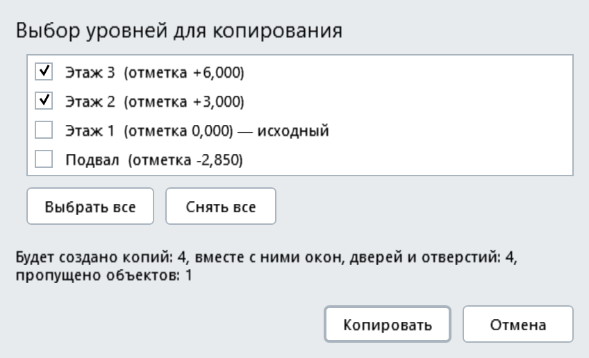
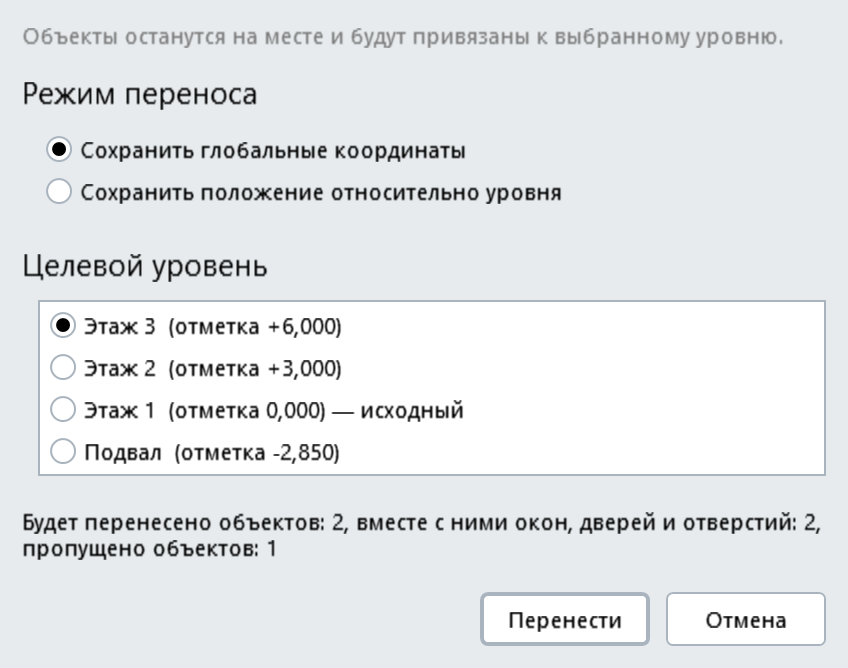
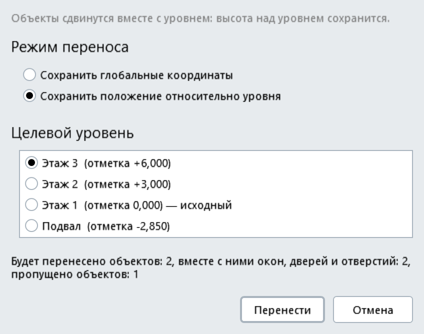

# Копирование и перенос по уровням для Renga

Плагин для [Renga](https://rengabim.com): копирует выделенные объекты на другие уровни и переносит их с одного уровня на другой. На панели «Действия» появляются две кнопки: «Копировать по этажам» и «Перенести на уровень».

Версия 0.2.

> Картинки в этом README - отрисовка окон плагина в тестовом приложении (с условными данными), а не снимки экрана из Renga: в самой Renga у окон есть заголовок и рамка, а названия уровней будут вашими.

## Возможности
- **Две кнопки** на панели «Действия» (в 3D-виде и в плане уровня): «Копировать по этажам» и «Перенести на уровень». Работают с тем, что выделено в модели.
- **Копирование на несколько уровней**: в окне отмечаются любые уровни, на каждом создаётся копия каждого выделенного объекта. Положение в плане (X, Y), поворот и высота относительно уровня остаются такими же, как у оригинала.
- **Перенос на один уровень** с двумя режимами:
  - **«Сохранить глобальные координаты»** (по умолчанию) - объект привязывается к выбранному уровню, но остаётся на тех же глобальных координатах, без вертикального смещения;
  - **«Сохранить положение относительно уровня»** - объект сдвигается вместе с уровнем, высота над уровнем сохраняется.

  Выбранный режим запоминается до перезапуска Renga.

  

  
- **Поддерживаемые типы объектов**: стены, ленточные фундаменты, балки, перекрытия, колонны, изолированные фундаменты, оборудование, механическое оборудование, сантехприборы, «Элементы».
- **Окна, двери и отверстия стен** копируются и переносятся вместе со стеной: на копии они появляются на тех же местах.
- **Уровень-источник** в списке помечен «исходный»; объекты, которые уже лежат на выбранном уровне, пропускаются.
- Итоговых окон нет: подробности (что создано, что пропущено и почему, сколько раз нажать Ctrl+Z) пишутся в журнал плагина.

## Требования
- Windows.
- Renga с поддержкой плагинов .NET 8 (в манифесте указан API 2.49).

## Установка
1. Скачайте архив `CopyToLevels-0.2.zip` на странице [Releases](../../releases).
2. Закройте Renga.
3. Распакуйте архив и скопируйте папку `CopyToLevels` в `C:\Program Files\Renga Professional\Plugins\` (потребуются права администратора).
4. Запустите Renga: на панели «Действия» появятся кнопки «Копировать по этажам» и «Перенести на уровень».

Если кнопок нет, посмотрите журнал `%localappdata%\Renga Software\Renga Professional\AecApp.log`. Журнал самого плагина - `%APPDATA%\CopyToLevels\`.

## Как пользоваться
**Копирование**
1. Выделите в модели объекты (3D-вид или план уровня).
2. Нажмите «Копировать по этажам» на панели «Действия».
3. Отметьте нужные уровни. «Выбрать все» и «Снять все» отмечают весь список. Строка под списком показывает, сколько копий будет создано и сколько объектов пропущено.
4. Нажмите «Копировать».

**Перенос**
1. Выделите объекты.
2. Нажмите «Перенести на уровень».
3. Выберите режим переноса и один целевой уровень.
4. Нажмите «Перенести».

Результат можно отменить Ctrl+Z. Число нажатий зависит от того, что было создано (обычно от одного до трёх), оно записывается в журнал плагина.

## Известные ограничения
- Новый объект создаётся, а при переносе исходный удаляется, поэтому **у переносимых объектов меняются id**. Сторонние связи по id, спецификации, построенные по id, и привязки к ним не сохраняются.
- **Электрооборудование на стене** (щиты, светильники, розетки) при копировании молча не копируется: стена копируется без него. При переносе такая стена не переносится вовсе (иначе оборудование потерялось бы вместе с исходной стеной), причина записывается в журнал.
- **Хозяева с проёмами и отверстиями, не являющиеся стенами**, пока не копируются и не переносятся: такие объекты пропускаются, причина - в журнале.
- Типы **лестница, пандус, крыша, арматура, пластина, линия, штриховка, сборка** пока не поддерживаются.
- Отменять результат нужно Ctrl+Z несколько раз (обычно 1-3): запись выполняется несколькими операциями, а не одной.
- Итоговых окон нет: подробности, число нажатий Ctrl+Z и причины пропусков - только в журнале `%APPDATA%\CopyToLevels\`.
- Одновременно работает только одна из двух команд.
- Плагин проверен автором на тестовых проектах; нестандартные случаи (повёрнутые или круглые отверстия, смещённые проёмы и т. п.) проверены не полностью и могут быть пропущены.

## О разработке
Плагин разработан с помощью искусственного интеллекта (Claude, Anthropic) под руководством автора. Работа плагина проверялась автором в Renga на тестовых проектах, но программа поставляется «как есть», без гарантий: перед использованием на важных проектах проверьте результат и сохраните копию проекта (изменения отменяются Ctrl+Z).

## Лицензия
Все права защищены, см. [LICENSE](LICENSE). Исходный код не публикуется. Сторонние компоненты: Renga.WPF.Styles (MIT), сборки Renga SDK.
